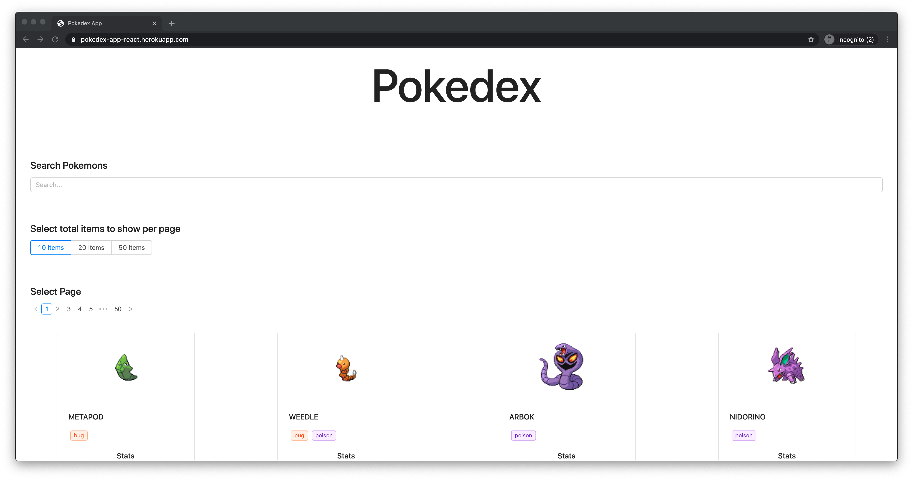

# Pokedex 

> A Pokedex App, data retrieved from [Pokedex API](https://pokeapi.co/)

## To run this app

1. clone the repo and go into the cloned directory.
2. Run `yarn install` or `npm install`.
3. Then run `yarn start` or `npm start`.

## Live Demo

[Live link](https://pokedex-app-react.herokuapp.com/)

## Features

* Search functionality.
* Pagination.
* Options for displaying number of items in a page.

## Author

- Email - [mohammadumar28@gmail.com](mailto:mohammadumar28@gmail.com)
- Twitter - [@mohammadumar28](https://www.twitter.com/Mohammadumar28)
